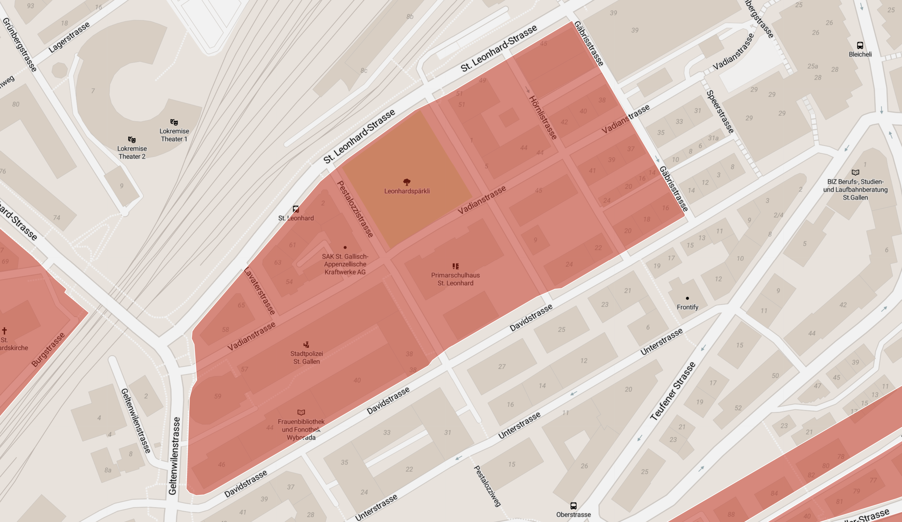
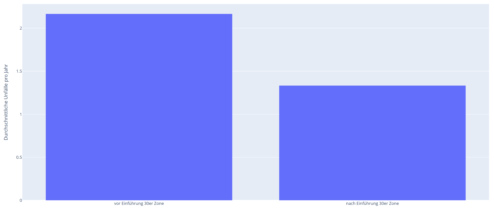
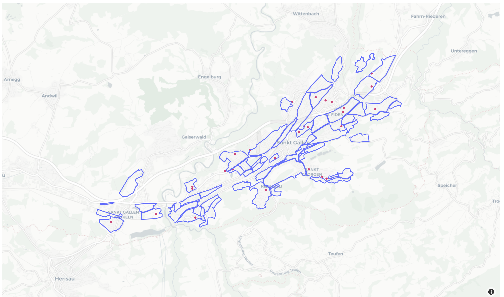

# Team 30er Zone
 
Unser Ziel war das Analysieren von Unfalldaten in Bezug auf die 30er Zonen in der Stadt St. Gallen. Insbesondere interessierte uns, ob die Einführung von 30er Zonen die Anzahl Unfälle reduziert hat.

## Datensätze

Verwendet wurde der [Tempo 30 Zone](https://daten.stadt.sg.ch/explore/dataset/tempo-30-zonen/information/?location=16,47.42013,9.38173&basemap=jawg.streets) Datensatz der Stadt St. Gallen, sowie die gemeldeten [Verkehrsunfälle](https://data.geo.admin.ch/ch.astra.unfaelle-personenschaeden_alle/) des Bundes.

## Libraries

Die **shapely** Library bietet dafür praktische Funktionalität, um Punkte und Polygone zu verwalten. Für das Auslesen der .csv files nutzt man praktischerweise **Pandas.Dataframes**, welche gut analysiert und geplotet werden können. A propos plotten. Mit **Plotly** konnten wir sehr viel schönere und interaktivere Datenplots erstellen, als mit dem eher plumperen *Matplotlib* möglich wäre. 

## Vorgehen

Als erstes mussten die Koordinaten der Unfallmeldungen vom [CH LV95](https://www.swisstopo.admin.ch/de/wissen-fakten/geodaesie-vermessung/bezugsrahmen/lokal/lv95.html) in Längen- und Breitengrade umgerechnet werden. So konnten sie einfach mit den gegebenen Polygonen der 30er Zonen verglichen werden. Dafür liefert [geo.admin](https://geodesy.geo.admin.ch/reframe/) praktischerweise eine Web API.

Auch der Datensatz mit den 30er Zonen musste noch gefiltert werden, da uns nur jene Zonen interessieren, welche während der Zeit, von der wir Unfalldaten haben (also 2011 - 2020) eingeführt wurden. 

Nun war alles bereit, um die Unfälle, welche in den übrig gebliebenen Zonen stattfanden, aufzuzeigen. Sehr schnell wurde sichtbar, dass kaum Verkehrsunfälle innerhalb der 30er Zonen geschahen. An sich sehr schön, für unsere Auswertung aber ungünstig. Die 30er Zone mit den meisten Unfällen ist jene in der Innenstadt. Also beschlossen wir, uns auf diese zu fokusieren.

Am 22. September 2017 wurde dieser Teil zur 30er Zone. Vom 2011 bis dahin gab es dort 13 Unfälle. Danach bis Ende 2020 noch 4. Das ergibt durchschnittlich etwas mehr als zwei Unfälle pro Jahr vor der Einführung und etwas mehr als 1,3 danach. In diesem, zugegeben sehr kleinen Datensatz kann also doch eine sinkende Tendenz festgestellt werden. 

Da wir also eine Korrelation feststellen konnten, überprüften wir als nächstes, ob sich die Schulhäuser der Stadt alle in 30er Zonen befinden. Bei den meisten ist dies tatsächlich so, leider aber nicht bei allen.

Die Schulhäuser Hochwald und Heimat in St. Fiden fallen schnell auf. In den letzten 10 Jahren gab es im Umkreis von 100m um die Schulhäuser aber nur fünf Verkehrsunfälle. Deshalb hatte dort die Einführung von neuen 30er Zonen wohl bisher keine Priorität.